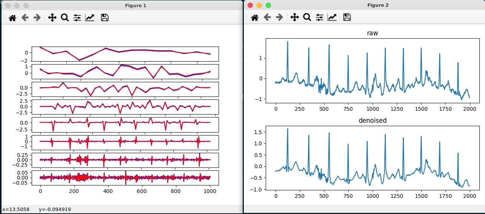

# AwesomeWavelets

some resources and code snippets about wavelet

## Code

using pywt

`omg*.py`

one demo(src in `omg02.py`):

left: coeffs, right: raw signal vs processed signal

## Resources

Links:

[PyWavelets(Python based package)](https://pywavelets.readthedocs.io/en/latest/)

[小波分析(wikipedia)](https://zh.wikipedia.org/wiki/小波分析)

[Wavelet(wikipedia)](https://en.wikipedia.org/wiki/Wavelet)

Files:

[小波变换及其应用(地球物理学进展)](./小波变换及其应用_paper.pdf)

[Matlab Wavelet Toolbox™ User's Guide](./Matlab_Wavelet_Toolbox.pdf)

[Wavelet for kids(a great tutorial for kids and adults)](./Wavelet_for_kids.pdf)

## TODO

- [ ] 完善小波变换的不同应用代码举例
- [ ] 写一篇 tutorial
- [ ] More great resources
